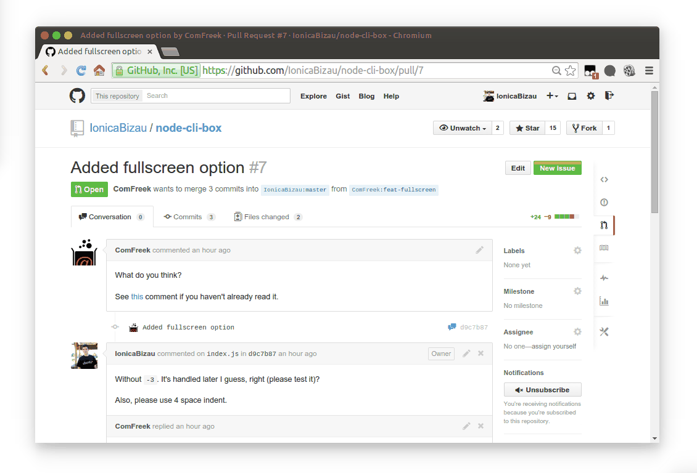

# gihtub-pr-branch-links

 [][paypal-donations] [](https://github.com/IonicaBizau/ama) [](https://www.npmjs.com/package/gihtub-pr-branch-links) [](https://www.npmjs.com/package/gihtub-pr-branch-links) [](https://www.codementor.io/johnnyb?utm_source=github&utm_medium=button&utm_term=johnnyb&utm_campaign=github)

> Open in a new tab the clicked branch on a pull request page.

## :cloud: Installation

```sh
$ npm i --save gihtub-pr-branch-links
```


## Usage

When clicking the `<username>:branch` the repository branch page is opened is opened in a new tab.


## Demo



## :yum: How to contribute
Have an idea? Found a bug? See [how to contribute][contributing].


## :scroll: License

[MIT][license] © [Ionică Bizău][website]

[paypal-donations]: https://www.paypal.com/cgi-bin/webscr?cmd=_s-xclick&hosted_button_id=RVXDDLKKLQRJW
[donate-now]: http://i.imgur.com/6cMbHOC.png

[license]: http://showalicense.com/?fullname=Ionic%C4%83%20Biz%C4%83u%20%3Cbizauionica%40gmail.com%3E%20(http%3A%2F%2Fionicabizau.net)&year=2014#license-mit
[website]: http://ionicabizau.net
[contributing]: /CONTRIBUTING.md
[docs]: /DOCUMENTATION.md
